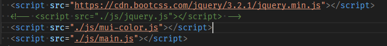

# mui-colors

material-ui 风格的调色参考.

模仿自: https://www.materialpalette.com/colors

## 效果图

## 在线使用

打开: https://cyanglory.github.io/mui-colors/

## 离线使用

> git clone https://github.com/CyanGlory/mui-colors.git

将 index.html 中的 jquery 替换为磁盘版, (默认使用 CDN 版).
下图中第一行注释掉, 第二行取消注释即可.

## 兼容性

请使用 google 打开, 不兼容 IE(效果不怎么好).