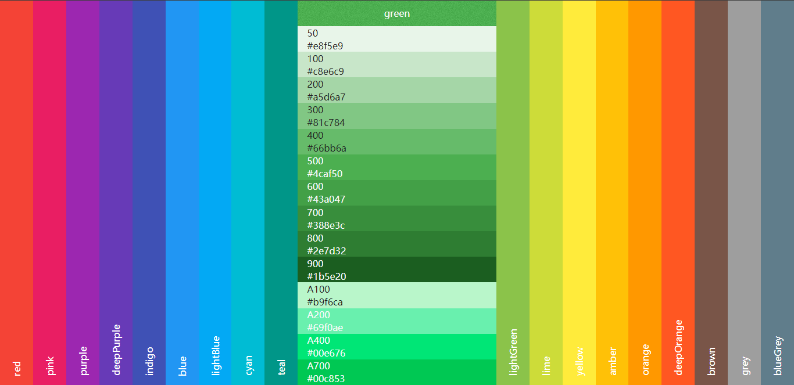

# mui-colors

material-ui 风格的调色参考.

模仿自: https://www.materialpalette.com/colors

## 效果图

## 使用方式

> git clone 当前项目

直接在浏览器打开 index.html 就好.

如需在无网络环境使用, 请自行替换 jquery 为磁盘版, (默认使用 CDN 版).

## 兼容性

请使用 google 打开, 不兼容 IE(效果不怎么好).